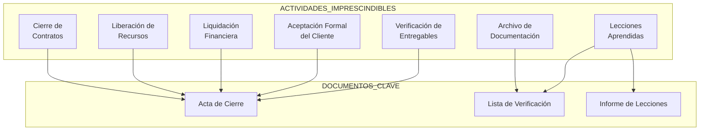

# Diagrama de Cierre de Proyecto

```mermaid
graph TD
    subgraph ACTIVIDADES_IMPRESCINDIBLES
        A[Verificación de<br>Entregables]
        B[Aceptación Formal<br>del Cliente]
        C[Liquidación<br>Financiera]
        D[Lecciones<br>Aprendidas]
        E[Liberación de<br>Recursos]
        F[Archivo de<br>Documentación]
        G[Cierre de<br>Contratos]
    end
    
    subgraph DOCUMENTOS_CLAVE
        H[Acta de Cierre]
        I[Lista de Verificación]
        J[Informe de Lecciones]
    end
    
    A --> H
    B --> H
    C --> H
    D --> I
    D --> J
    E --> H
    F --> I
    G --> H
```
